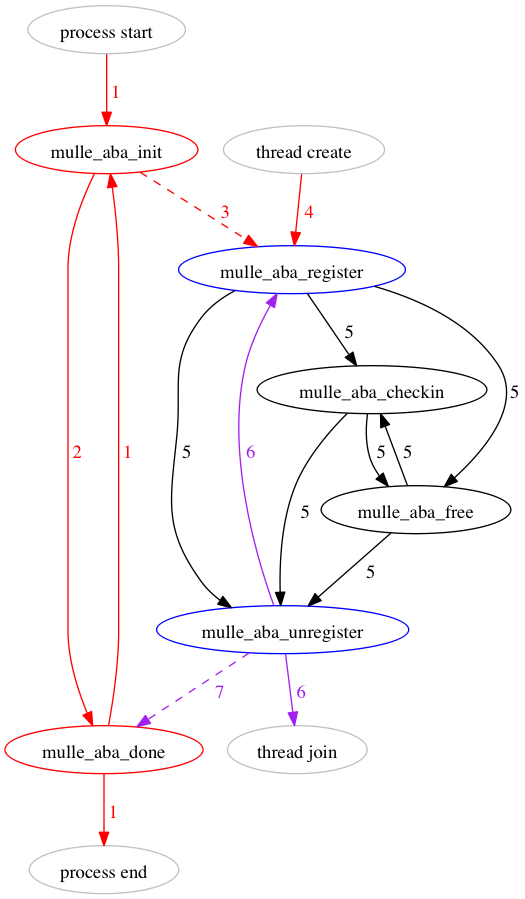

# mulle-aba


## How to use it

Link against `mulle_aba` and
`#include <mulle-aba/mulle-aba.h>` in your code.


## Rules of mulle-aba

Threads have to cooperate in **mulle-aba**. If a non-cooperating thread is
accessing memory referenced by **mulle-aba**, your program is likely
to crash. If a registered thread is not calling `mulle_aba_checkin` often
enough, your program will bloat. Such are the rules and limitations of
**mulle-aba**.


## Overview




Node Colors

* Red   : single threaded
* Blue  : soft locking, multi threaded
* Black : lock free, multi threaded
* Gray  : context

Edge style

* Dashed : main thread (the one who called mulle_aba_init)
* Solid  : any thread

> In "normal" thread operation, a threads work is all done with `mulle_aba_checkin`
> and `mulle_aba_free`, thus `mulle-aba` can claim to be essentially lock-free in
> operation.


# API


## `void mulle_aba_init( struct mulle_allocator *allocator)`

*Available in state 1 (red)*

Call this function to initialize **mulle-aba**. Don't call any other
**mulle-aba** function before calling this. In terms of the diagram you are in
State 1 (red). The allocator will be used to allocate memory for the
**mulle-aba** system. It is a struct defined like this:

```c
struct mulle_allocator
{
   void   *(*calloc)( size_t n, size_t size);
   void   *(*realloc)( void *block, size_t size);
   void   (*free)( void *block);
   void   (*abafree)( void *aba, void *block);
   void   *aba;
};
```

> If `calloc` locks, then **mulle-aba** will also lock, when it
needs to allocate memory.

If you pass in NULL, the `mulle_default_allocator` will be used, that is
configured to use `calloc`, `realloc`, `free`. If this function detects that
the allocator is the `mulle_default_allocator` it will augment `abafree` and
`aba` with the proper values.

This function is not thread safe (red).

Ex.

```c
mulle_aba_init( NULL);
```


## `void mulle_aba_done( void)`

*Available in state 2 (red) an 6 (purple)*

Call this function to finish **mulle-aba**. Your process then needs to call
`mulle_aba_init` before doing anything with **mulle-aba** again. Be very sure
that all participating threads have unregistered **and** joined before calling
`mulle_aba_done`. If the allocator is the `mulle_default_allocator`, then
this function will remove abafree from the allocator.

This function is not thread safe (red).


## `void   mulle_aba_register( void)`

*Available in states 3 (red) and 5 (purple)*

Your thread must call this function before accessing any shared resources that
should be protected by **mulle_aba**. The main thread should also call
`mulle_aba_register`. Typically this is done once, at the beginning of the
thread.

Only one thread can be registering (or unregistering) at once, and other threads
will be looping. The registration does not block or lock `mulle_aba_free`
or `mulle_aba_checkin`!

This is a soft-blocking (blue) operation.

Ex.

```c
static void  run_thread( void *info)
{
    mulle_aba_register();
    ...
}

...
mulle_thread_create( &threads, NULL, (void *) run_thread, "VfL Bochum 1848");
...
```


## `int   mulle_aba_is_registered( void)`

*Always available*

You can check if the current thread is registered with this function.
Returns 0, if not registered.


## `void   mulle_aba_unregister( void)`

*Available in state 4 (black)*

You call this function at the end of your thread. This includes the main thread.

Only one thread can be unregistering (or registering) at once, and other threads
will be looping. You don't have to call `mulle_aba_checkin before calling
`mulle_aba_unregister`.

This is a soft-blocking (blue) operation.


## `int   mulle_aba_free( void (*free)( void *), void *pointer)`

*Available in state 4 (black)*

Use this function to free a shared pointer safely. In a cooperative
setting, this guarantees that the freed pointer does not run afoul of the ABA
problem. The actual freeing of the pointer is delayed until all threads have
checked in.

> This operation is designed to be lock-free (black). Note that if your supplied
**free** operation is locking, then **mulle-aba**'s is not lock-free.

Ex.

```c
    s = some_unused_shared_malloced_resource();
    mulle_aba_free( free, s);
```

## `void   mulle_aba_checkin( void)`

*Available in state 4 (black)*

This function must be periodically called by all cooperating threads. It acts
like a memory barrier and frees delayed pointers, that have been relinquished
by all other threads.

This operation is lock-free (black). If any `free` routine of the pointers
blocks or locks, this operation also blocks.
